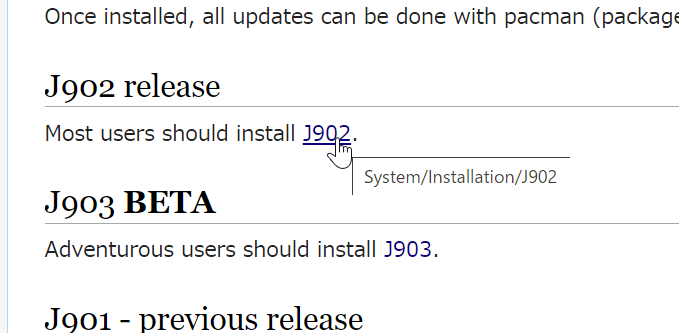
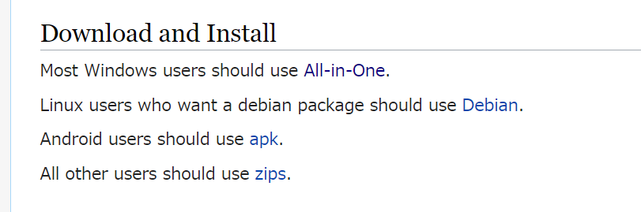

# J言語

## J言語とは

J言語はプログラミング言語であり、正式名称は「**J**」だがC言語と同じように「J言語」と呼ばれている。

J言語はAPLの後継として提案されたプログラミング言語で、APLと同じ処理をASCIIコードのみで記述することができる。
さらに、APLにはない機能や文法が追加され、現在も更新が続いている。

- APL

```apl
4×-/÷¯1+2×⍳1e5  ⍝ コメント
```

- J

```j
4*-/%1+2*i.1e5  NB. コメント
```

また、数式を**短く単純に**記述することに特化していて、計算途中に変数や制御構文をほとんど使わずに書くことができる。
とくに配列の処理に優れていて、九九の計算ならたった**8バイト**のプログラムでできる。

```j
   */~1+i.9
1  2  3  4  5  6  7  8  9
2  4  6  8 10 12 14 16 18
3  6  9 12 15 18 21 24 27
4  8 12 16 20 24 28 32 36
5 10 15 20 25 30 35 40 45
6 12 18 24 30 36 42 48 54
7 14 21 28 35 42 49 56 63
8 16 24 32 40 48 56 64 72
9 18 27 36 45 54 63 72 81
   
```

J言語は、計算が右から左に進むことや、ASCIIコードのほとんどが演算子として割り当てられていること（J言語ではダブルクォーテーションすらも演算子である。）など、くせの多いプログラミング言語であるが、驚くほど短く書くことができる文法や、強力な配列演算など、魅力も多く持っている言語である。

**J言語はすばらしいプログラミング言語だ！**

## インストール方法

※ iOS版は[App Store](https://apps.apple.com/jp/app/j701/id1255235993)からダウンロードできるが、バージョン 7.01 から更新されていない。

1. 公式サイトの[インストールページ](https://code.jsoftware.com/wiki/System/Installation)から最新バージョンのリンクを選択する。



2. プラットフォームにあったインストール方法を選択し、リンク先のページの指示に従ってダウンロード、インストールする。



3. Android以外の場合は、Jのインストールが完了したらjconsoleを起動し、次のように入力してパッケージをインストールする。

```j
load 'pacman'
'install' jpkg '*'
```

パッケージのインストールが完了したら、 `exit 0` と入力してjconsoleを終了する。

Androidの場合は、JAndroidを起動してメニューの「Tools」から「Package Manager」を選択し、「Select All」ですべてにチェックを入れてから「Install」を押してインストールする。

## ウェブサイト

- [Jsoftware](https://www.jsoftware.com/) （公式サイト）
- [J Wiki](https://code.jsoftware.com/wiki/Main_Page) （Wiki）
- [J (プログラミング言語)](https://ja.wikipedia.org/wiki/J_(%E3%83%97%E3%83%AD%E3%82%B0%E3%83%A9%E3%83%9F%E3%83%B3%E3%82%B0%E8%A8%80%E8%AA%9E)) （ウィキペディア）
